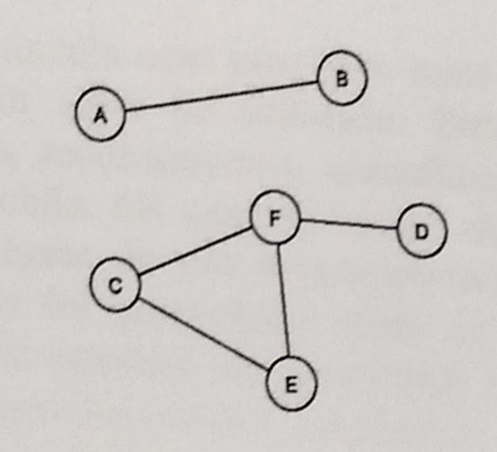

# Trabalho de Pesquisa Operacional

O objetivo de e trabalho é solucionar um problema de otimização proposto pelo professor. Os grupos devem utilizar o enunciado dos problemas apenas como uma referência básica para o trabalho. Cada grupo será responsável por buscar mais informações à respeito do problema a ser solucionado. O trbalho é dividido em três etapas. Na primeira o **problema deve ser formulado matematicamente, explicitando todos os seus parâmetros e variáveis, função objetivo e restrições, e um exemplo.** Na segunda etapa, o modelo deve ser revisto e resolvido através de um solver escolhido pelo grupo, apresentando as instâncias, pelo menos duas e de dimensões diferentes, e resultados. A terceira e última etapa consiste em propor e implementar um algoritmo, em qualquer linguagem, e que não seja um algoritmo de força-bruta, para resolver o problema, apresentando um pseudo-código, resultados e comparação com os resultados do solver. Cada problema apresentado deverá ser resolvido por um grupo de até 5 alunos. Em cada etapa o grupo deve apresentar um relato atendendo as exigências.

### PROBLEMA 1
Um alpinista deve carregar sua mochila com possíveis itens de seu interesse. A cada item atribui-se o seu peso e um valor de utilidade. Entretanto, os itens são de agrupamentos distintos (alimentos, medicamentos, utensílios, etc.) e devem estar em compartimentos separados na mochila. Os ompartimentos da mochila são flexíveis e têm capacidades limitadas. A inclusão de um ompartimento tem um custo fixo que depende do agrupamento com que foi preenchido, além de introduzir uma perda da capacidade da mochila. O problema consiste em determinar as capacidades adequadas de cada compartimento e como esses devem ser carregados, maximizando o valor de utilidade total e descontado o custo de incluir compartimentos.

### PROBLEMA 2
Uma árvore geradora $T$ de um grafo $G$ é um subgrafo acíclico e conexo, que conecta todos os nós. Toda árvore geradora de $G$ tem $n - 1$ arcos. Dado um grafo não direcionado $G = (N, A)$ com $n = |N|$ nós e $m = |A|$ arcos, com um comprimento ou custo $c_{ij}$ associado à cada arco $(i, j) \in A$, desejamos encontrar uma árvore geradora, denominada árvore geradora mínima, que tem o menor custo total de seus arcos constituíntes, medido como a soma dos custos dos arcos presentes em $T$, e que cada nó tenha um grau menor ou igual a $p$.

### PROBLEMA 3
Seja um projeto definido como um conjunto de atividades e um conjunto $A$ de relações de precedência entre as atividades. Se $(i, j) \in A$, então a atividade $i$ deve ser concluída antes de iniciar a atividade $j$. Cada atividade $j$ tem um duração conhecida $d_{ij}$. O problema consiste em identificar o plano do projeto (i.e., a hora de início de cada atividade) que irá satisfazer as relações de precedência entre as atividades e terminar o projeto no menor tempo, ou duração, possível.

### PROBLEMA 9
Um conjunto de tarefas deve ser executado, utilizando sequências fixas de diferentes máquinas. Para cada tarefa o tempo de processamento (soma dos tempos de processamento em cada máquina) é dado. Duas tarefas podem ou não fazer uso de uma (ou mais) mesma máquina. Nesse caso são consideradas incompatíveis, ou seja, não podem ser executadas em paralelo. Seja o conjunto $J$ de tarefas a serem executadas e dado o conjunto de pares de tarefas incompatíveis $E$ (se tarefas $i$ e $j$ são incompatíveis então o par $(i,j)$ pertence a $E$), determinar o tempo de início $t_j$ de cada tarefa $j$ de forma a concluí-las o mais cedo possível (definido como makespan) e respeitando as restrições de incompatibilidade. Veja a figura abaixo: as tarefas A e B, C, F e E, e F e D, são incompatíveis.


=======
# Problema 9

Seja $J$ o conjunto de tarefas e $E$ as arestas de dependência das tarefas em $J$.

- $y_{ij}$ é uma variável binária que determina a ordem de duas tarefas dependentes dependentes.
- $d_i$ é o parâmetro de duração de cada tarefa.
- $M$ é o maior valor da soma das durações.

\[\min \sum\limits_{j\;\in\;J} {\max (f_{j})}\]

\[f_{j} \geq t_i + d_i,\;\;i,j\in J\]
$\forall (i,j) \in E$, temos:
\[
t_i \geq t_j + d_j - y_{ij}M \\
t_j \geq t_i + d_i - (1-y_{ij})M \\
\]
com a variável binária de decisão $y_{ij} \in \{0,1\}$.


### model

```
set J;
set E, dimen 2;

param d{J}, >=0;
param M;

var t{i in J}, >=0;
var y{(i,j) in E}, binary;
var max_t, >=0;

s.t. cov{(i,j) in E}:
	t[i] >= t[j] + d[j]  - y[i,j]*M;

s.t. cov2{(i,j) in E}:
	t[j] >= t[i] + d[i]  -  (1-y[i,j])*M;

s.t. maxt{i in J}:
	max_t >= t[i] + d[i];

minimize z: max_t;
end;

```

### data (test1)

```
set J := A, B, C, D;
set E :=  A B, C D;

param d  :=
	A	1
	B	2
	C	3
	D	4	;

param M := 15;

end;
```

```
GLPSOL: GLPK LP/MIP Solver, v4.52
Parameter(s) specified in the command line:
 --model Prob9.mod --data Instancia1.data
Reading model section from Prob9.mod...
21 lines were read
Reading data section from Instancia1.data...
Instancia1.data:12: warning: final NL missing before end of file
12 lines were read
Generating cov...
Generating cov2...
Generating maxt...
Generating z...
Model has been successfully generated
GLPK Integer Optimizer, v4.52
9 rows, 7 columns, 21 non-zeros
2 integer variables, all of which are binary
Preprocessing...
8 rows, 7 columns, 20 non-zeros
2 integer variables, all of which are binary
Scaling...
 A: min|aij| =  1.000e+00  max|aij| =  1.500e+01  ratio =  1.500e+01
GM: min|aij| =  1.000e+00  max|aij| =  1.000e+00  ratio =  1.000e+00
EQ: min|aij| =  1.000e+00  max|aij| =  1.000e+00  ratio =  1.000e+00
2N: min|aij| =  9.375e-01  max|aij| =  1.000e+00  ratio =  1.067e+00
Constructing initial basis...
Size of triangular part is 8
Solving LP relaxation...
GLPK Simplex Optimizer, v4.52
8 rows, 7 columns, 20 non-zeros
      0: obj =   3.000000000e+00  infeas =  7.000e+00 (0)
*     5: obj =   4.000000000e+00  infeas =  0.000e+00 (0)
OPTIMAL LP SOLUTION FOUND
Integer optimization begins...
+     5: mip =     not found yet >=              -inf        (1; 0)
+     7: >>>>>   7.000000000e+00 >=   7.000000000e+00   0.0% (2; 0)
+     7: mip =   7.000000000e+00 >=     tree is empty   0.0% (0; 3)
INTEGER OPTIMAL SOLUTION FOUND
Time used:   0.0 secs
Memory used: 0.1 Mb (140599 bytes)

```

### data 2 (test2)

```
set J := A, B, C, D, E, F;
set E :=  A B, C F, C E, E F, F D;

param d  :=
	A	7
	B	5
	C	3
	D	2
	E	4
	F	2	;

param M := 24;

end;
```

```
GLPSOL: GLPK LP/MIP Solver, v4.52
Parameter(s) specified in the command line:
 --model Prob9.mod --data Instancia2.data
Reading model section from Prob9.mod...
21 lines were read
Reading data section from Instancia2.data...
Instancia2.data:14: warning: final NL missing before end of file
14 lines were read
Generating cov...
Generating cov2...
Generating maxt...
Generating z...
Model has been successfully generated
GLPK Integer Optimizer, v4.52
17 rows, 12 columns, 43 non-zeros
5 integer variables, all of which are binary
Preprocessing...
16 rows, 12 columns, 42 non-zeros
5 integer variables, all of which are binary
Scaling...
 A: min|aij| =  1.000e+00  max|aij| =  2.400e+01  ratio =  2.400e+01
GM: min|aij| =  1.000e+00  max|aij| =  1.000e+00  ratio =  1.000e+00
EQ: min|aij| =  1.000e+00  max|aij| =  1.000e+00  ratio =  1.000e+00
2N: min|aij| =  7.500e-01  max|aij| =  1.000e+00  ratio =  1.333e+00
Constructing initial basis...
Size of triangular part is 16
Solving LP relaxation...
GLPK Simplex Optimizer, v4.52
16 rows, 12 columns, 42 non-zeros
      0: obj =   7.000000000e+00  infeas =  1.500e+01 (0)
*     7: obj =   1.100000000e+01  infeas =  0.000e+00 (0)
*     9: obj =   7.000000000e+00  infeas =  0.000e+00 (0)
OPTIMAL LP SOLUTION FOUND
Integer optimization begins...
+     9: mip =     not found yet >=              -inf        (1; 0)
+    13: >>>>>   1.200000000e+01 >=   1.200000000e+01   0.0% (3; 0)
+    13: mip =   1.200000000e+01 >=     tree is empty   0.0% (0; 5)
INTEGER OPTIMAL SOLUTION FOUND
Time used:   0.0 secs
Memory used: 0.1 Mb (145782 bytes)
```
>>>>>>> master
