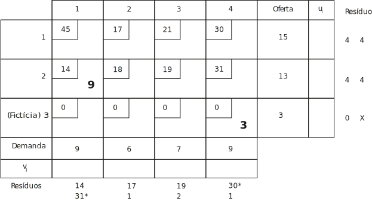
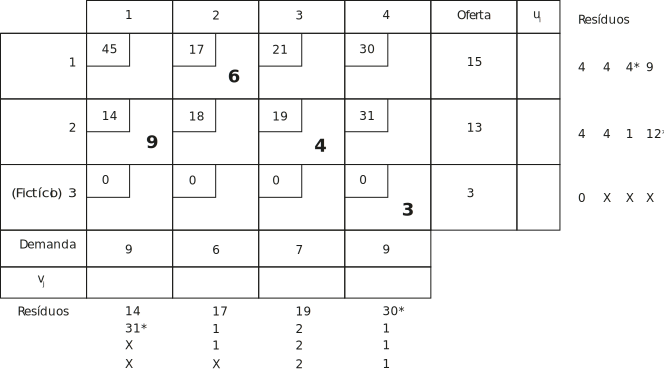

# DCC035 - Pesquisa Operacional

> Yuri Diego Santos Niitsuma

**Questão**: Uma companhia locadora de automóveis se defronta com um problema de alocação  resultante dos contratos de locação que permitem sejam os automóveis devolvidos em localidades outras que aquelas onde foram originalmente alugados. No presente momento há duas agências de locação (origens) com, respectivamente, 15 e 13 carros excedentes e quatro outras agências (destinos) necessitando de 9, 6, 7 e 9 carros, respectivamente. Os custos unitários de transporte (em dólares) entre as locadoras são os seguintes.

|  |Dest. 1| Dest. 2| Dest. 3| Dest. 4|
|--|--|--|--|--|
| Origem 1 | 45 | 17 | 21 | 30 |
| Origem 2 | 14 | 18 | 19 | 31 |

A) Faça a formulação inicial do quadro de transporte.

B) A partir do quadro proposto no quadro do item A, utilize a regra do canto noroeste para obter uma solução básica.

C) Análogo ao item B, utilize o método de Vogel para determinar uma solução básica.

<!-- D) Resolva o problema de transportes a partir da solução básica do item B. -->

### Solução

#### item A
Uma vez que a demanda total $9 + 6 + 7 + 9 = 31$ excede a oferta total $15 + 13 = 28$, criou-se uma origem fictícia tendo uma oferta igual ao déficit de 3 unidades. Na realidade, nunca serão feitos transportes a partir dessa origem e, assim, os custos de transporte associados são tomados iguais a zero. Alocações positivas desta origem para algum destino representam carros que não podem ser entregues devido ao déficit da oferta. Esses valores são o déficit que o destino em questão experimentará para se ter um esquema de transportes ótimo.

> Os valores dos elementos $x_{ij}$, $u_i$ e $v_j$ não estão assinalados tendo em vista que se tratam de grandezas desconhecidas no momento.

#### item B

Começa-se com $x_{11}$ atribuindo-lhe como valor o mínimo entre $a_1 = 15$ e $b_1 = 9$. Assim, $x_{11} = 9$, deixando-se seis carros excedentes na primeira origem.  
Em seguida, desloca-se uma célula para a direita e aloca-se $x_{12} = 6$. Estas duas alocações juntas esgotam a oferta da primeira origem.  
Assim desloca-se uma célula para baixo e considera-se $x_{22}$. Observa-se, contudo, que a demanda do segundo destino foi satisfeita pela alocação de $x_{12}$.  
Uma vez que não se lhe pode entregar carros adicionais sem ultrapassar sua demanda, deve-se alocar $x_{22} = 0$ e então desloca-se uma célula para à direita.  
Continuando-se desta maneira obtém-se a solução degenerada (o número de elementos *positivos* menor que 4 + 3 - 1 = 6) retratada no quadro abaixo.

#### item C

<!-- Os dois menores custos da linha 1 do quadro são 17 e 21; seu resíduo é 4. os dois menores custos da linha 3 são ambos iguais a zero; assim seu resíduo é 0. Repetindo-se esta análise para as colunas, geram-se os resíduos mostrados na periferia do quadro abaixo. Uma vez que o maior destes resíduos, indicado por um * , ocorre na coluna 4, localiza-se a variável (célula) desta coluna possuidora do menor custo de transporte e aloca-se a esta tantas unidades quantas forem possíveis. Portanto, $x_{34} = 3$, esgotando-se a oferta da origem 3 e eliminando-se a linha 3 de considerações posteriores. -->

<!-- Computa-se, em seguida, de novo, os resíduos de cada linha e de cada coluna sem referência aos elementos da linha 3. Os resultados estão mostrados nos lados do quadro abaixo, onde o valor $X$ para o segundo resíduo na linha 3 significa simplismente que esta linha foi eliminada. O maior resíduo aparece na coluna 1 -->

